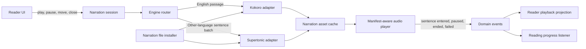

# Kokoro and Supertonic Narration Migration

## Status

Proposed for review. No implementation work should begin until the decisions in the review section
are accepted and the Phase 0 runtime spike passes its gates.

## Decision Summary

Sonelle will replace Piper with two local narration engines:

- Kokoro is the English engine. It prepares paragraph-sized passages and returns a sentence timing
  manifest so English narration keeps sentence highlighting while gaining paragraph-level prosody.
- Supertonic is the fallback engine for known non-English languages and books whose language cannot
  be resolved confidently. It prepares bounded batches of independent sentences so sentence
  highlighting remains exact even though Supertonic does not expose intra-utterance timestamps.
- Playback remains offline after the required narration files have been installed.
- The reader remains sentence-oriented. Paragraph narration changes how audio is prepared and
  buffered; it does not change bookmarks, reading progress, manual sentence navigation, or the
  sentence-level highlighting decision.

This will be progressive passage preparation, not true frame-by-frame network-style streaming.
Sonelle starts when the active passage is ready and prepares following passages while it plays.
The external narration interface must not prevent a future adapter from supplying audio
incrementally, but the first Kokoro integration should not pretend completed passages are a stream.

## Why This Requires A Migration

The current narration path is sentence-shaped from top to bottom:

- `SentenceNarrationRequest` is the public audio request.
- the renderer prepares and plays one sentence, then advances the reader when that file ends;
- the prefetch cache stores upcoming sentence promises;
- the native cache writes one `sentence.wav` per request;
- the voice catalog assumes every selectable voice is a Piper model download;
- voice readiness assumes one Piper runtime plus one model/config pair;
- cache statistics count `sentence.wav` files;
- release automation stages Windows libraries required by Piper;
- the settings migration and language resolver persist one global Piper voice ID.

Replacing only the executable would preserve all of those assumptions and waste Kokoro's timing
data. The migration therefore starts by making the narration module engine-independent, then adds
the two adapters behind that interface.

## Product Invariants

The implementation must preserve all of the following:

1. The highlighted sentence is the sentence currently being narrated.
2. Previous, next, and clicked-sentence navigation starts at the requested sentence.
3. Turning off auto-advance stops after the current sentence, even when the audio file contains the
   rest of a paragraph.
4. Pausing does not allow another passage to start, and resuming in the same session continues from
   the captured passage position.
5. Closing the reader stops narration and cancels or makes irrelevant outstanding preparation.
6. Reading progress and bookmarks continue to use Sonelle sentence IDs.
7. Word lookup remains independent of audio timing.
8. No TTS work, model loading, audio decoding, or cache traversal blocks the webview thread.
9. The application remains useful as a reader when narration is not installed or needs attention.
10. User-facing copy describes preparing audio and offline voices, never engines, manifests,
    inference workers, cache keys, or queues.

## Engine Routing

Routing belongs to the audio module, not the Solid UI or the native adapters.

| Resolved book language                      | Engine               | Preparation shape                                              | Highlight source                              |
| ------------------------------------------- | -------------------- | -------------------------------------------------------------- | --------------------------------------------- |
| English (`en`)                              | Kokoro               | One paragraph, split only at sentence boundaries when required | Kokoro timing manifest                        |
| Supported, known non-English language       | Supertonic           | Bounded batch of independent sentences                         | Exact sample length of each returned sentence |
| Missing, ambiguous, or unsupported language | Supertonic with `na` | Bounded batch of independent sentences                         | Exact sample length of each returned sentence |

The EPUB language remains the first authority. English must only route to Kokoro when the normalized
language is confidently `en`; guessing English would trade a graceful fallback for broken
pronunciation. Automatic content-language detection can be added later behind the language
resolution interface and is not required for this migration.

Supertonic currently documents 31 explicit language codes plus `na`. The adapter must maintain an
allowlist derived from the pinned model version rather than passing arbitrary EPUB metadata to the
engine.

## Target Module Shape



### Ownership

`packages/audio` owns:

- engine-independent narration requests and prepared narration results;
- engine and voice resolution;
- passage construction from paragraph sentence ranges;
- timing-manifest validation;
- bounded preparation and prefetch policy;
- the narration session interface and deterministic fake adapters;
- persisted audio-setting migration rules.

The native audio module owns:

- ONNX Runtime sessions and engine-specific inference;
- G2P/text processing required by each pinned model;
- model lifecycle, memory policy, audio encoding, and atomic cache writes;
- artifact download, integrity checks, readiness, and platform-specific runtime files.

The manifest-aware player owns:

- decoded audio playback;
- a media-time cursor that remains correct when playback speed changes;
- mapping sample positions to sentence IDs;
- starting inside a prepared passage;
- stopping at a requested sentence boundary;
- pause, resume, stop, and disposal.

The reader module owns:

- translating the active chapter's existing paragraph and sentence projections into a narration
  outline;
- sending user intent to the narration session;
- projecting narration events into highlight, controls, scrolling, and friendly notices.

The reader UI must not select an engine, inspect a manifest, construct a native command, or know
whether an asset contains one sentence or a paragraph.

## Proposed Narration Interface

The exact names can move during implementation, but the behavioral contract should remain small:

```ts
interface NarrationSession {
  open(input: NarrationChapter): Promise<void>;
  play(sentenceId: string): Promise<void>;
  pause(): void;
  moveTo(sentenceId: string): Promise<void>;
  setOutput(settings: NarrationOutputSettings): void;
  close(): Promise<void>;
}
```

`open` supplies an immutable chapter outline containing book language, paragraph ranges, ordered
sentences, and the resolved voice preference. The session hides routing, passage selection,
preparation, caching, playback, prefetching, cancellation, and engine differences.

Prepared assets use sample offsets instead of floating-point seconds:

```ts
interface PreparedNarration {
  assetId: string;
  sourceUrl: string;
  sampleRate: number;
  sampleCount: number;
  sentences: readonly NarrationSentenceSpan[];
  cached: boolean;
}

interface NarrationSentenceSpan {
  sentenceId: string;
  startSample: number;
  endSample: number;
}
```

Sample offsets avoid accumulated rounding drift. A prepared result is valid only when spans are
ordered, monotonic, non-overlapping, within the audio length, and cover every requested sentence.
Invalid Kokoro alignment must never reach the reader.

## Event Flow

User intent may call the small narration-session interface directly. Long-running consequences are
represented as events so one function does not prepare audio, mutate UI state, persist progress,
scroll the document, and display errors in one increasingly cursed breath.

Proposed event evolution:

- `AudioPreparationRequested` becomes passage-capable by identifying the anchor sentence and
  selected voice. It remains during the compatibility phase.
- `PassageNarrationReady` records the covered sentence range, voice ID, engine ID, and whether the
  asset came from local cache or fresh preparation.
- `NarrationSentenceEntered` records the active sentence as playback crosses a manifest boundary.
- `NarrationPlaybackPaused`, `NarrationPlaybackEnded`, and `NarrationPlaybackFailed` describe
  playback facts.
- `VoiceInstallationRequested`, `VoiceInstallationReady`, and `VoiceInstallationFailed` remain
  user-oriented. Their listener resolves the shared engine files required by the requested voice.

Event listeners independently own:

- active-sentence and playback-state projection;
- reading-position persistence;
- scrolling the active sentence into view;
- event journal persistence;
- toast notification on failure;
- preparing the next passage.

High-frequency playback clock updates are internal player observations and are not persisted as
domain events. Only sentence changes and lifecycle facts cross the event dispatcher.

## English Passage Preparation With Kokoro

1. Select the paragraph containing the requested sentence from the existing reader projection.
2. Preserve Sonelle's original ordered sentence IDs and text.
3. If the paragraph exceeds Kokoro's verified phoneme/token limit, split it only between sentences.
   Never split the text in the middle of a Sonelle sentence.
4. Run Kokoro once for the passage so it can use context across its sentences.
5. Convert Kokoro token timestamps or predicted durations into sample offsets.
6. Map the timed tokens back to Sonelle sentences using normalized source offsets and a monotonic
   matcher. Punctuation normalization must not silently move a boundary.
7. Validate the resulting manifest against the encoded audio length and requested sentence list.
8. Atomically write the audio plus manifest to the cache.
9. Start at the requested sentence's `startSample`, not necessarily at the beginning of the
   paragraph.
10. Prefetch the next paragraph-sized passage while the current passage plays.

### Alignment Failure Policy

Sentence highlighting is a product invariant, so an uncertain manifest is not "close enough."

For the first release, a passage whose alignment cannot be validated falls back to Kokoro requests
for its individual sentences. Each sentence's exact audio length produces a valid manifest. This
loses paragraph prosody for that passage but keeps narration usable and highlighting honest. The
failure is logged in development with enough structured context to improve the matcher; the reader
only sees an error if sentence fallback also fails.

Forced alignment is intentionally out of scope until real-book QA proves the duration-derived
manifest insufficient. Adding another model and several hundred megabytes preemptively would be a
remarkably expensive way to avoid collecting evidence.

## Non-English Preparation With Supertonic

Supertonic does not expose intra-utterance text timestamps, so it must not synthesize a whole
paragraph and estimate sentence boundaries.

Instead:

1. Build a bounded look-ahead set beginning at the requested sentence.
2. Send each Sonelle sentence as an independent batch item using the resolved language code and
   selected Supertonic voice style.
3. Retain each returned waveform's exact sample count.
4. Store each sentence as an independently addressable prepared asset, or combine the batch into
   one cache asset with exact sample boundaries. The runtime spike will select the faster option.
5. Play sentences in order and prefetch the next bounded set.

Batching reduces repeated model overhead without inventing false timing metadata. Playback speed
continues to be an output setting; changing it must not generate duplicate cache files.

## Native Runtime Strategy

### Preferred Direction

Use one native ONNX Runtime integration shared by both engines, with engine-specific implementations
behind a private native interface. Supertonic publishes an official Rust ONNX example. Kokoro also
has an official ONNX export, but its official English pipeline depends on Misaki and `espeak-ng` for
G2P/fallback behavior. That preprocessing and timestamp mapping are the main technical unknowns.

Do not make a Python installation a product prerequisite. Do not commit to a bundled Python or
PyInstaller sidecar until the spike measures its installer size, cold start, memory, and signing
cost against the native path. The development-only reference harness may use the official Python
pipelines to produce golden audio and manifests.

### Runtime Spike Deliverables

Build throwaway, command-line-only prototypes for these candidates:

1. Native Rust plus ONNX Runtime for both engines, reproducing Kokoro English preprocessing and
   retaining duration output.
2. A small Sonelle-owned native sidecar if direct Rust integration makes Tauri linking or model
   lifecycle materially worse.
3. Bundled Python only as a measured fallback, not the default assumption.

Run every candidate on Windows x64, Linux x64, macOS Intel, and macOS Apple Silicon before choosing.
The spike must report:

- packaged runtime size and downloaded model size;
- cold and warm model load time;
- time to first playable uncached passage;
- real-time factor for short, medium, and long passages;
- peak resident memory with one engine loaded and after switching engines;
- CPU utilization while reading and while idle;
- manifest accuracy against the official Kokoro Python output;
- process shutdown, cancellation, and corrupted-model behavior;
- signing/notarization and dynamic-library requirements.

Only one engine should remain loaded by default. The runtime manager unloads the previous engine on
a language-family switch unless the measured memory budget proves retaining both is harmless. This
prevents Kokoro and Supertonic from quietly renting the reader's entire RAM allocation.

## Voice Catalog And Settings Migration

The voice catalog becomes engine-independent. Each entry needs:

- stable Sonelle voice ID;
- label, description, locale/language applicability, and gender/style metadata used by the UI;
- engine ID and engine-native voice/style ID;
- required narration-file pack ID;
- pinned model/catalog revision;
- downloads, sizes, hashes, and licenses for every artifact in that pack.

Model files are shared by several voices. Readiness therefore belongs internally to a narration-file
pack, while the UI continues asking whether the selected offline voice is ready.

Persist voice preferences per normalized language rather than one global voice ID:

```ts
voicePreferences: {
  en: "kokoro:af-heart",
  fr: "supertonic:F3",
  "*": "supertonic:F3"
}
```

When a book opens, the audio module resolves its language and preference without mutating unrelated
languages. Existing settings migrate as follows:

- American Piper English voices map to the selected default American Kokoro voice;
- British Piper English voices map to the selected default British Kokoro voice;
- French Piper maps to the chosen default French-compatible Supertonic style;
- unknown or invalid IDs are discarded and resolved from the active language default.

The exact Kokoro and Supertonic defaults must be chosen through listening tests, not by whichever
identifier happens to look friendliest in JSON.

## Installation And Artifact Management

Replace the Piper-specific installer with a generic narration-file installer that still presents a
voice-oriented interface to the reader.

Required behavior:

- download only the pack needed by the selected language/voice;
- reuse a downloaded engine model across every voice that depends on it;
- stream downloads to temporary files;
- verify SHA-256 before atomic rename;
- record a small installed-pack manifest containing model version, artifact hashes, and platform;
- detect partial, stale, corrupt, and incompatible installations;
- support retry without redownloading already verified artifacts;
- report cumulative progress across shared runtime, model, G2P data, and voice/style files;
- keep downloads outside the installer bundle so users who never use narration do not pay the
  model-size cost;
- provide license and attribution notices required by Kokoro, Supertonic, ONNX Runtime, G2P, and
  any bundled native libraries.

Model license review is a release gate. Kokoro's code and weights are Apache-licensed according to
its official repository; Supertonic's sample code is MIT and its model is OpenRAIL-M. Shipping must
be reviewed against the pinned artifact licenses rather than relying on README summaries.

## Cache V3

Create a new cache namespace rather than trying to reinterpret Piper WAVs.

The cache key includes:

- cache schema version;
- engine and model revision;
- voice/style ID;
- language code;
- ordered sentence IDs and normalized text;
- synthesis parameters that change generated samples;
- output sample rate and encoding revision.

It excludes playback rate and volume because those are output settings.

Each cache record contains:

- encoded audio;
- a versioned manifest with sample rate, sample count, sentence spans, engine/model identity, and
  source-text digest;
- atomic completion marker or equivalent validated metadata.

Cache reads reject incomplete files, invalid spans, changed text, mismatched model revisions, and
impossible audio lengths. Cache statistics report bytes and covered sentences without assuming one
file equals one sentence. Existing Piper cache files are ignored by V3 and removed when the user
clears prepared audio; an optional one-time cleanup can remove the obsolete namespace after rollout.

## Manifest-Aware Playback

The current HTML audio player resolves only when one complete file ends. Replace it behind its seam
with a player that understands sentence spans while still hiding Web Audio from Solid components.

The player must:

- decode a prepared asset once;
- maintain media time in samples, including playback-rate changes;
- emit `sentenceEntered` exactly once per boundary crossed;
- start at any sentence boundary within the asset;
- stop at the end of the current sentence when auto-advance is disabled;
- pause and resume without starting another passage;
- stop and release all sources on book/chapter/view/voice changes;
- ignore stale callbacks from disposed playback generations;
- use one persistent gain bus for volume;
- resolve only after the requested playback range is fully consumed;
- fall back to element playback only when it can preserve boundary behavior, otherwise report that
  narration needs attention instead of lying about synchronization.

The active sentence comes from player boundary events, not timers owned by the UI. Tests use a fake
media clock and synthetic manifests so timing behavior is deterministic.

## Implementation Phases

### Phase 0: Decision Record And Runtime Spike

Deliverables:

- add an ADR superseding `0004-local-narration.md` while preserving the sentence-highlighting ADR;
- pin candidate Kokoro and Supertonic model revisions;
- build and benchmark the runtime candidates;
- prove Kokoro paragraph output can be mapped to Sonelle sentence IDs on representative English
  text;
- test model licenses and redistribution requirements;
- choose the native runtime, artifact layout, initial voice shortlist, and performance budgets.

Exit gate:

- one self-contained runtime candidate works on all four release targets;
- its manifests pass validation on the English QA corpus;
- its size, startup, memory, and synthesis results are accepted in a written spike report.

### Phase 1: Engine-Independent Contracts

Deliverables:

- replace sentence-only public audio types with prepared-narration and sentence-span types;
- introduce chapter narration outlines and paragraph passage construction;
- add the engine router and engine-independent catalog schema;
- add audio-setting V2 parsing and migration while continuing to serialize settings Piper can use;
- implement deterministic fake adapters for passage and sentence-batch results;
- add proposed events without removing the old event path.

Exit gate:

- existing Piper playback still works through a compatibility adapter;
- package tests prove routing, passage splitting, settings migration, manifest validation, cache
  identity, and stale-request cancellation.

### Phase 2: Narration Session And Player

Deliverables:

- extract playback orchestration from `reader-experience.tsx` into the deep narration-session
  module;
- implement the manifest-aware player and fake media clock;
- project sentence-boundary events back into the existing reader playback state;
- support play, pause, resume, previous, next, clicked sentence, auto-advance off, chapter end, book
  close, voice change, and playback-rate changes;
- prefetch one bounded passage ahead and discard stale results by session generation.

Exit gate:

- Piper compatibility assets represented as one-span manifests reproduce current behavior;
- browser/unit integration tests cover every playback transition without native TTS;
- no orchestration code in Solid components knows cache, engine, or timing details.

### Phase 3: Generic Installer And Cache V3

Deliverables:

- introduce the installed-pack catalog and generic downloader;
- implement V3 audio/manifest cache with atomic writes and validation;
- project pack readiness through the existing voice-installation workflow;
- migrate cache statistics to bytes plus covered sentence count;
- add development diagnostics and humane production failures;
- keep Piper installation/status code available behind its compatibility adapter.

Exit gate:

- fake-download tests cover reuse, resume/retry policy, corruption, hash mismatch, cleanup, and
  shared-model readiness;
- cache tests cover partial writes, invalid manifests, model upgrades, concurrent preparation, and
  clearing;
- installation works from scratch on every release target.

### Phase 4: Kokoro English Path

Deliverables:

- implement the chosen native Kokoro adapter;
- implement English G2P and alignment mapping equivalent to the pinned reference pipeline;
- prepare paragraph passages with safe sentence-boundary splitting;
- implement per-sentence Kokoro fallback for invalid alignment;
- add initial American and British voice choices selected by listening tests;
- route confidently English books to Kokoro behind a development feature flag.

Exit gate:

- sentence highlighting never leads or trails the audible sentence in the QA corpus;
- punctuation, abbreviations, quotations, numbers, dialogue, headings, em dashes, and very long
  sentences pass alignment tests;
- manual navigation into the middle of a paragraph starts at the correct sample;
- warm prefetch prevents audible gaps during representative chapters;
- Windows, Linux, Intel macOS, and Apple Silicon smoke tests pass.

### Phase 5: Supertonic Fallback Path

Deliverables:

- implement the native Supertonic adapter using the same runtime and installer infrastructure;
- batch independent Sonelle sentences while retaining exact per-sentence lengths;
- map supported language codes and `na` conservatively;
- expose a curated initial style list rather than every identifier by default;
- route non-English and unresolved-language books behind a development feature flag.

Exit gate:

- French plus at least four structurally different supported languages pass real-book smoke tests;
- sentence transitions do not overlap or truncate;
- language switches unload or retain models according to the measured memory policy;
- unknown-language input fails gracefully or uses `na` without selecting an English Kokoro voice.

### Phase 6: Migration, Rollout, And Piper Removal

Deliverables:

- enable the new router by default for development, then beta builds;
- migrate persisted voice preferences and preserve volume, speed, and auto-advance;
- exercise fresh installation, upgrade installation, corrupted files, offline launch, and cache
  clearing on every platform;
- collect opt-in development metrics and structured logs for time to playable audio, cache hit,
  alignment fallback, model load, synthesis, and peak memory;
- remove Piper only after the rollback window closes;
- delete Piper setup scripts, runtime downloads, environment variables, tests, cache version,
  Windows CRT staging that is no longer required, and obsolete documentation;
- update the narration module contract, development guide, release guide, QA checklist, and ADRs.

Exit gate:

- all acceptance criteria below pass with the new path enabled and Piper disabled;
- CI builds and tests all supported native targets;
- release artifacts install and narrate from a clean machine;
- the old feature flag can be deleted without changing reader UI code.

## Pull Request Sequence

Keep the migration reviewable and reversible:

1. ADR, spike harness, corpus, and benchmark report.
2. Engine-independent domain/audio contracts and settings migration.
3. Manifest validator, fake adapters, and cache-key rules.
4. Narration session extraction using the Piper compatibility adapter.
5. Manifest-aware player and playback projections.
6. Generic installed-pack manager and Cache V3.
7. Kokoro native adapter behind a flag.
8. Kokoro alignment hardening and English QA.
9. Supertonic native adapter behind a flag.
10. Supertonic multilingual QA and language routing.
11. Default-on migration and release workflow expansion.
12. Piper removal after the measured rollback period.

Do not combine runtime introduction, player replacement, voice-setting migration, and Piper deletion
in one PR. That would make failures difficult to localize and rollback needlessly dramatic.

## Delivery Model

Development uses a stable `main` branch, a protected `dev` integration branch, and short-lived
feature branches:

```text
main
  `-- dev
       |-- featt/narration-contracts
       |-- featt/manifest-player
       |-- featt/narration-installer
       |-- featt/kokoro-english
       |-- featt/supertonic-fallback
       `-- featt/narration-migration
```

- `main` is always releasable. Its existing successful-CI release trigger remains enabled.
- `dev` contains the integrated contents of the next release. Pushes and pull requests run CI but
  never publish a release.
- every narration feature branch starts from the latest `dev`, covers one coherent phase, includes
  its tests, and targets `dev`;
- incomplete paths remain behind the hybrid-narration configuration while the working Piper path
  stays available;
- `dev` must compile and pass its current tests after every merge even while the overall migration
  is incomplete;
- normal feature pull requests never target `main`;
- the release pull request is `dev` into `main` after the complete acceptance checklist passes.

Every push to `dev` produces non-published candidate bundles for Linux x64, Windows x64, macOS
Intel, and macOS Apple Silicon. During final stabilization, `dev` is frozen, updated with the latest
`main`, and exercised through clean-install, upgrade, model-download, offline, cache, playback, and
real-book QA. Defects are fixed through focused branches targeting `dev`, then the candidate is
rebuilt and retested.

Immediately before the release pull request:

1. confirm `dev` contains the latest `main` and no unrelated unfinished feature;
2. enable the hybrid router by default and run the complete automated and manual matrix;
3. record the candidate commit and attach platform artifacts plus QA evidence;
4. freeze both release contents and dependency locks;
5. open the single `dev` to `main` pull request;
6. merge only when the resulting source tree matches the tested candidate;
7. let `main` CI and the existing release workflow publish the completed version;
8. merge `main` back into `dev` so the release merge commit is part of the integration history.

Protect both branches with required CI and pull requests. Direct pushes are not part of the normal
workflow. This keeps incremental development reviewable without making partially integrated work a
public release.

## Test And QA Matrix

### Contract Tests

Run the same adapter contract suite against Kokoro, Supertonic, Piper compatibility, and fakes:

- readiness and missing files;
- deterministic cache identity;
- valid audio and manifest shape;
- repeated preparation returns a cache hit;
- stop/close makes late results irrelevant;
- malformed requests and unsupported languages fail safely;
- engine errors produce stable internal error categories and humane reader messages.

### Playback Tests

- start from first and middle sentences;
- cross multiple boundaries in one passage;
- pause/resume before, on, and after a boundary;
- change speed and volume during playback;
- previous/next/clicked sentence while preparing and while playing;
- auto-advance on and off;
- final sentence, empty chapter, and chapter transition;
- book switch, reader close, voice switch, cache clear, and app shutdown;
- stale player callbacks and failed decode;
- no truncation, overlap, double advancement, or duplicate boundary event.

### Alignment Corpus

Build a checked-in text-only corpus plus locally configured copyrighted-book QA covering:

- American and British prose;
- dialogue and nested quotation marks;
- abbreviations, initials, acronyms, dates, money, ordinals, and decimals;
- parentheses, colons, semicolons, ellipses, and em dashes;
- headings, one-word paragraphs, footnote markers, and lists;
- sentences near and beyond the model limit;
- EPUB text containing unusual whitespace and Unicode punctuation.

The automated suite validates manifest structure. Human QA listens for prosody and verifies that
the highlight changes only when the audible sentence changes.

### Platform Matrix

- Windows x64;
- Linux x64 under AppImage and at least the primary package format;
- macOS Intel;
- macOS Apple Silicon.

Every release target tests clean install, model download, offline restart, first synthesis, cached
playback, engine switch, cache clearing, and uninstall leftovers.

## Performance Gates

Phase 0 records the existing Piper baseline on named reference machines. Final thresholds are
written into the ADR after measurement, but rollout must satisfy these minimum rules:

- narration work introduces no webview long task over 50 ms;
- cached playback start is no slower than the current Piper cached path at p95;
- uncached time to first playable English passage is no slower than current Piper at p95 unless a
  documented quality trade is explicitly accepted;
- the next passage is ready before current playback reaches its final two seconds in at least 99%
  of the representative chapter run;
- model switching returns unused engine memory instead of accumulating both engines indefinitely;
- idle narration performs no polling or CPU work;
- cache size grows with prepared text once, not with playback-rate or volume changes;
- a failed prefetch never interrupts audio that is already playing.

Record p50, p95, and worst case for model load, preparation, cache read, decode, playback start, and
engine switch. A single cheerful average is how latency problems put on a fake moustache.

## Observability

Development logs should include structured fields for:

- engine/model revision and voice ID;
- preparation kind, requested sentence range, and text length;
- cache hit/miss and validation rejection category;
- model load, G2P, inference, encoding, and total preparation duration;
- alignment fallback reason without logging full copyrighted book text;
- playback generation, requested start sentence, boundary transitions, and stop reason;
- installer artifact, bytes, hash verification, and readiness failure;
- peak or sampled process memory in the benchmark harness.

Production presents only actionable toasts and voice-readiness states. It does not expose internal
engine names unless they are intentionally part of a credits/licenses surface.

## Rollback Strategy

- Keep the Piper adapter and old installed files readable until both new paths complete beta QA.
- Guard routing with one configuration switch that selects `legacy-piper` or `hybrid-v1` before the
  reader creates a narration session.
- Use a new cache namespace so rollback does not reinterpret new assets as Piper sentences.
- Keep settings migration capable of reading the old shape throughout the rollback window.
- Do not delete old Piper files automatically until the hybrid path has shipped successfully.
- If Kokoro alignment fails broadly, route English through sentence-level Kokoro before falling all
  the way back to Piper. This preserves the new installation path while removing manifest risk.
- If a platform runtime fails release validation, keep that platform on Piper instead of delaying or
  weakening verified platforms.

## Explicitly Out Of Scope

- word-level highlighting;
- cloud narration;
- voice cloning or user-imported voice styles;
- chapter-sized single audio files;
- forced-alignment models before evidence requires one;
- automatic content-language detection for missing EPUB metadata;
- mobile runtime integration;
- changing bookmarks or persisted reading progress below sentence granularity;
- exposing engine tuning controls such as diffusion steps or phoneme limits in the reader UI.

## Review Decisions

The recommended answers are included so review can focus on actual disagreements:

1. **Runtime:** approve native ONNX Runtime as the preferred direction, subject to the Phase 0
   cross-platform spike. Bundled Python remains a measured fallback only.
2. **English preparation:** approve one paragraph per Kokoro passage, split only between sentences
   when model limits require it.
3. **Alignment failure:** approve sentence-level Kokoro fallback rather than approximate highlights
   or an immediate forced-aligner dependency.
4. **Non-English preparation:** approve Supertonic batch inference with one independent utterance per
   Sonelle sentence.
5. **Unknown language:** approve Supertonic `na`; do not guess English.
6. **Voice settings:** approve preferences per normalized language with a wildcard fallback, replacing
   one globally persisted voice.
7. **Downloads:** approve on-demand model packs rather than inflating every desktop installer.
8. **Memory:** approve one loaded engine by default, adjustable only after measurements.
9. **Rollout:** approve compatibility flags and delayed Piper deletion rather than a big-bang swap.
10. **Scope:** keep word timing, voice cloning, mobile, and content-language detection outside this
    migration.

## References

- Kokoro's official repository documents its 82M-parameter model, Python pipeline, Misaki G2P, and
  `espeak-ng` fallback: <https://github.com/hexgrad/kokoro>
- Kokoro's pipeline exposes English token timing derived from predicted durations:
  <https://github.com/hexgrad/kokoro/blob/main/kokoro/pipeline.py>
- Supertonic documents native ONNX examples across Rust and the supported desktop platforms:
  <https://github.com/supertone-inc/supertonic>
- Supertonic's Python documentation lists its 31 languages, `na` fallback, model download, batching,
  and synthesis controls: <https://supertone-inc.github.io/supertonic-py/quickstart/>
- Sonelle's existing narration contract: [`../modules/narration.md`](../modules/narration.md)
- Sonelle's current local narration decision:
  [`../decisions/0004-local-narration.md`](../decisions/0004-local-narration.md)
- Sonelle's sentence-highlighting decision:
  [`../decisions/0001-sentence-highlighting.md`](../decisions/0001-sentence-highlighting.md)
- Sonelle's language-aware narration decision:
  [`../decisions/0013-language-aware-narration.md`](../decisions/0013-language-aware-narration.md)
